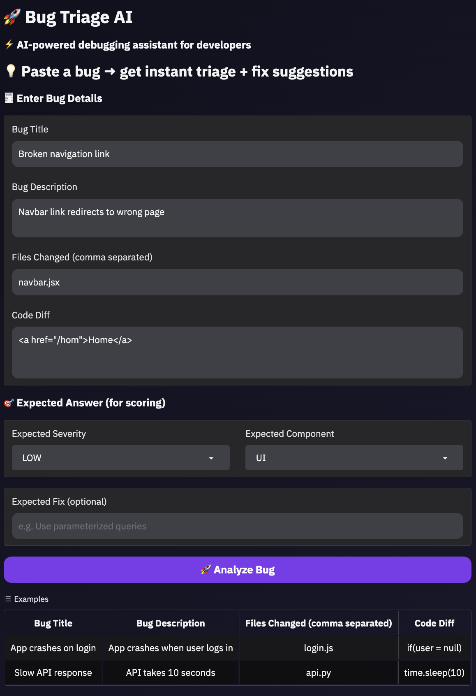
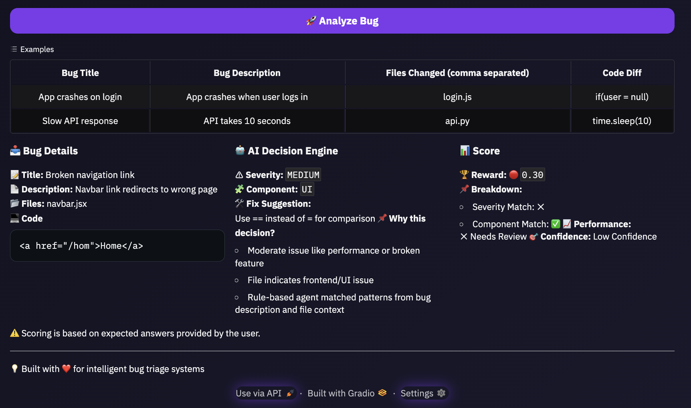

# 🐞 Bug Triage AI — OpenEnv Project

## 🚀 Live Demo

👉 Hugging Face Space: **https://huggingface.co/spaces/Neeraj140805/bug-triage-env**

---

## 📌 Overview

This project implements a **Bug Triage AI system** using an OpenEnv environment, where an AI agent simulates real-world software engineering tasks:

* 🔍 Bug classification
* 🧩 Component detection
* 🛠️ Fix suggestion

It provides a **fully interactive UI** where users can input bugs and evaluate AI performance.

---

## 🎯 Key Features

* ✅ AI-powered bug analysis
* ✅ Explainable decisions (Why this decision?)
* ✅ Real-time scoring system
* ✅ User-controlled evaluation (Expected Answer system)
* ✅ Clean and modern Gradio UI

---

## 🧠 How It Works

1. User enters:

   * Bug title
   * Description
   * Files changed
   * Code diff

2. AI predicts:

   * Severity (LOW / MEDIUM / HIGH)
   * Component (UI / BACKEND / DATABASE / API)
   * Fix suggestion

3. User provides **expected answers**

4. System calculates reward:

   * Severity match
   * Component match
   * Fix similarity

---

## 📊 Reward System

| Metric      | Weight |
| ----------- | ------ |
| Severity    | 40%    |
| Component   | 30%    |
| Fix Quality | 30%    |

Final score ∈ [0, 1]

---

## 🖥️ UI Preview

* Interactive bug input form
* AI analysis panel
* Score breakdown with explanations
* Confidence + performance indicators
### 🔹 Input Interface


### 🔹 AI Analysis Output


---

## 📦 Project Structure

```bash
.
├── app.py              # Gradio UI
├── env.py              # OpenEnv environment
├── baseline.py         # Rule-based agent
├── inference.py        # Submission entry point
├── evaluate.py         # Evaluation script
├── requirements.txt
└── README.md
```

---

## ⚙️ Setup & Run Locally

```bash
pip install -r requirements.txt
python app.py
```

---

## 🧪 Run Evaluation

```bash
python evaluate.py
```

---

## 🤖 Inference (Important for Submission)

The `inference.py` file:

* Uses environment variables:

  * `API_BASE_URL`
  * `MODEL_NAME`
  * `HF_TOKEN`
* Runs the agent
* Outputs structured predictions

Logs follow:

```
START → STEP → END
```

---

## 🔍 Example

**Input:**

```
Title: Broken navigation link  
Description: Navbar redirects to wrong page  
File: navbar.jsx  
Code: <a href="/hom">Home</a>
```

**Output:**

```
Severity: MEDIUM  
Component: UI  
Fix: Correct the route path to "/home"
```

---

## 🏆 Why This Project Stands Out

* 🔥 Real-world problem (bug triage automation)
* 🧠 Explainable AI decisions
* ⚖️ Honest evaluation system (user-controlled ground truth)
* 🎯 Interactive demo (judge-friendly)

---

## 📌 Future Improvements

* LLM-based fix generation
* Dataset-driven evaluation
* Leaderboard system

---

## ❤️ Built For

* AI Engineering
* Developer Productivity Tools
* OpenEnv Evaluation Systems

---

## 👨‍💻 Author

Neeraj Singh
